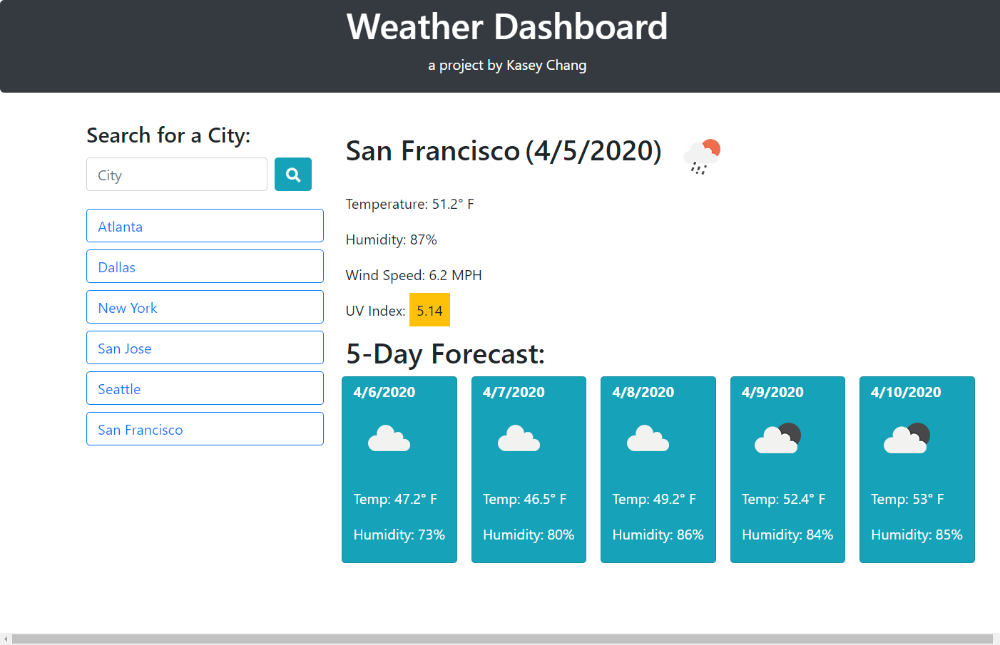
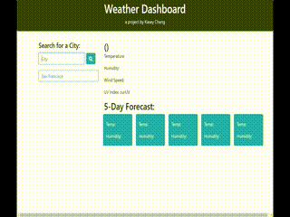

# weather-dashboard

Project weather-dashboard is a lightweight single-page Javascript app that allow user to query OpenWeatherMap for present day and 5-day forecast of 
set cities. One start with nothing, and simply enter cities to add it to
the list of cities. Click on the city name to retrieve data for that city. 

### Project Repo

http://github.com/kschang77/weather-dashboard

### Deployed Link

https://kschang77.github.io/weather-dashboard/

# Demo Recording

No installation required

# Built With 

[Javascript](https://developer.mozilla.org/en-US/docs/Web/JavaScript)

[Bootstrap 4](https://getbootstrap.com/docs/4.4/getting-started/introduction/)

[jQuery](https://jquery.com/)

[FontAwesome](https://fontawesome.com/)

[OpenWeather](https://openweathermap.org/api)

## Code Snippet

This bit is the submit button event handler when one enters a city and hits enter or clicks submit. The field was read into a temporary variable, and pre-pended to the cityList, then the whole list is saved via saveCity(). Then a refresh is called to update the display, and the field value itself is set back to blank, then the weather tiles are updated. 

        $(".form-inline").on('submit', function(event){
            event.preventDefault();
            var tempCity = $("#city").val(); 
            cityList.unshift(tempCity)
            console.log(cityList)
            saveCity();
            $("#city").val("");
            refreshCity();
            queryCurrentWeather(tempCity);
        })

## Author

**Kasey Chang** 

- [Link to Github](https://kschang77.github.io)
- [Link to LinkedIn](https://www.linkedin.com/in/kasey-chang)

## License

This project is licensed under the MIT License 

## Acknowledgments

* Hat tip to Jerome, Kerwin, Mahi, and the UCBEx Coding Bootcamp March 2020 cohort
